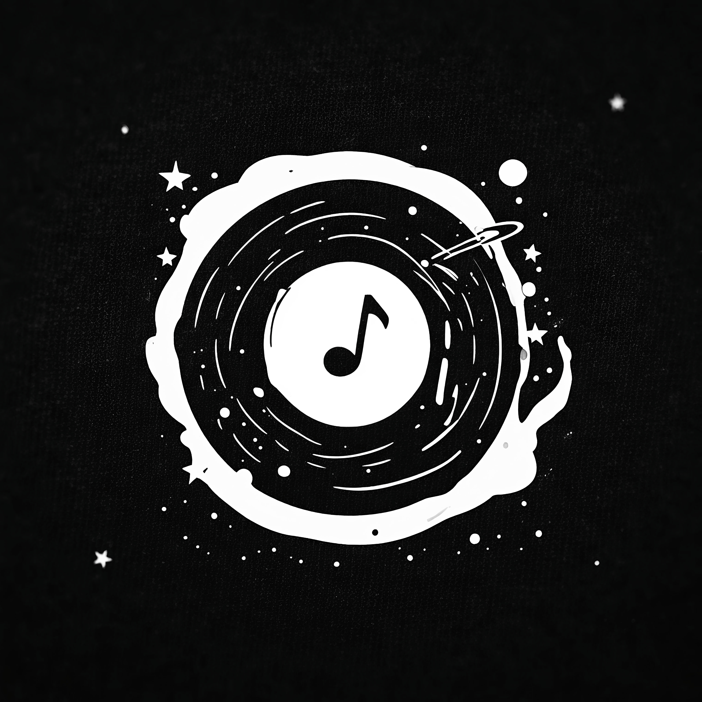

<div align="center">
  

  <h1>Nebula</h1>

  <p><b>Ad-free YouTube Music streaming with synced lyrics, offline downloads, local playlists, and a hand-built VoxMusic-inspired design.</b></p>
</div>

# Nebula

## Overview

Nebula is an open-source YouTube Music streaming app for Android. It pairs
YouTube Music's vast catalog with a hand-built VoxMusic-inspired design —
chunky borders, offset shadows, and theme palettes — plus offline downloads,
synced lyrics, and local playlists.

> [!IMPORTANT]
> Nebula is in **early development**. Expect rough edges and missing features.
> See [CHANGE.md](CHANGE.md) for what's landed and what's next. Updates are
> manual — grab the latest APK from the
> [Releases page](https://github.com/GoD444v/Nebula/releases).

## Table of Contents

- [Overview](#overview)
- [Screenshots](#screenshots)
- [Technical Architecture & Stack](#technical-architecture--stack)
- [Features](#features)
- [Installation & Setup](#installation--setup)
- [Support the Project](#support-the-project)
- [Contributors](#contributors)
- [Special Thanks](#special-thanks)
- [Legal Disclaimer](#legal-disclaimer)
- [License](#license)

## Screenshots

<table>
<tr>
<td align="center">Home Screen</td>
<td align="center">Player Tab</td>
<td align="center">Lyrics</td>
</tr>

<tr>
<td></td>
<td></td>
<td></td>
</tr>

<tr>
<td align="center">Search</td>
<td align="center">Playlist</td>
<td align="center">Settings</td>
</tr>

<tr>
<td></td>
<td></td>
<td></td>
</tr>
</table>

## Technical Architecture & Stack

Nebula is built on modern Android development practices, emphasizing clean
architecture, modularity, and high performance.

**Core Stack**

- **Kotlin:** 100% written in Kotlin, utilizing Coroutines and Flow for
  asynchronous data streams and state management.
- **UI Framework:** Jetpack Compose (Material 3) with a custom VoxMusic-inspired
  design system — 6 palettes + custom palette builder, 3px borders, offset-shadow
  "chunky" components.
- **Architecture:** MVVM (Model-View-ViewModel). State is managed via `StateFlow`
  and hoisted where appropriate. No Hilt, no NavHost — tab state lives in
  `MainActivity`.

**Media & Playback**

- **Media3 (ExoPlayer):** The playback engine is powered by AndroidX Media3,
  providing a robust `MediaSessionService` that deeply integrates with Android's
  system media controls and background playback capabilities.
- **InnerTubeX Engine:** Handles media stream resolution and search/browse via
  the `innertubex` library (Gradle dependency, not vendored).
- **Local Media Management:** Built-in capability to scan and play local
  on-device audio files.

**Persistence & Data**

- **Room Database:** SQLite abstraction for caching local songs, custom
  playlists, and downloaded playlist metadata locally.
- **DataStore:** Type-safe preference storage using Jetpack DataStore
  (Preferences) to handle theme, tab order, and download settings.

**Lyrics Under the Hood**

- **Multi-provider fan-out:** Tier-ranked lyrics fetch across Kpoe/LyricsPlus,
  Kugou (KRC decode ported from `kugou-lyric`), Unison (TTML parse), and LRCLIB —
  with automatic best-pick and style customization. See [NOTICE](NOTICE).

## Features

**Upcoming Features**

> - YouTube Music account sync (library, liked songs, playlists)
> - Podcast support
> - Crossfade between tracks

<details>
<summary><b>Streaming & Playback</b></summary>

- **Ad-Free** — Stream without any interruptions.
- **Background Playback** — Listen while using other apps or with the screen off.
- **Offline Mode** — Download tracks via a dedicated download manager with
  progress notification and cancel action.
- **WiFi-Only Downloads** — Reduce data consumption when on cellular networks.
- **Seamless Playback** — Mini player + full-sheet now-playing screen.
- **Queue Persistence** — Queue and position survive restarts (resumes paused,
  never auto-plays).
- **Repeat / Shuffle** — Full playback mode support.

</details>

<details>
<summary><b>Playlists & Library</b></summary>

- **Local-First Playlists** — Create, rename, delete, and organize playlists
  stored in Room.
- **Add-to-Playlist Sheet** — Add any song to any playlist from the song menu.
- **Manual Reorder & Sorting** — Drag or arrow-reorder; sort by custom, name,
  or date.
- **Downloaded Playlist** — All offline tracks in one place with play/shuffle.
- **YouTube Import** — Paste a public playlist link, no sign-in.
- **Song-List Import** — Paste `Artist - Title` lines (Spotify copy-paste shape),
  first search hit wins each line.
- **CSV Export + Share** — Echo-compatible CSV or plain-text share from the
  playlist overflow.
- **Albums Browser** — Explore albums with detail pages.
- **Local Media** — Scan and play on-device audio files.

</details>

<details>
<summary><b>Personalized Home</b></summary>

- **Genre Sections** — Picked at onboarding (or changed later in Settings),
  pinned Funk / Tamil / J-Pop first.
- **Because You Have X** — Related tracks grown from your own playlists.
- **Because You Like Y** — Related tracks grown from picked artists.
- **Home Visibility** — Master switch plus per-playlist toggles in Settings;
  the Downloaded mirror stays off Home by default.

</details>

<details>
<summary><b>Backup & Restore</b></summary>

- **One JSON File** — Playlists, songs, genres, artists, theme, tabs, and
  visibility through the system file picker. No accounts, no servers.
- **Full Restore** — Wipe data, import the file, everything comes back.

</details>

<details>

<summary><b>Lyrics</b></summary>

- **Synced Lyrics** — Real-time synchronized lyrics from multiple providers.
- **Word-by-Word Timings** — Precise per-word synchronization where available.
- **Style Customization** — Font size, highlight, alignment, and word-timings
  toggle.
- **Multi-Provider** — Kpoe/LyricsPlus, Kugou, Unison, and LRCLIB with
  automatic best-pick.

</details>

<details>
<summary><b>Customization</b></summary>

- **Theme Palettes** — 6 curated palettes + custom palette builder.
- **Light / Dark / System** — Full theme mode support.
- **Reorderable Tabs** — Customize bottom navigation order (persisted).
- **Switchable App Icons** — 3 launcher icons to choose from.

</details>

## Installation & Setup

**Android Installation**

Download the latest pre-compiled APK from the
[Releases page](https://github.com/GoD444v/Nebula/releases).

<details>
<summary><b>Building from Source</b></summary>

Clone the repository:

```bash
git clone https://github.com/GoD444v/Nebula.git
cd Nebula
```

Open in Android Studio and press Run — `local.properties` (SDK path) is
generated by the IDE on first open. Or via CLI:

```bash
./gradlew assembleDebug
```

Run tests:

```bash
./gradlew testDebugUnitTest          # JVM unit tests
./gradlew connectedDebugAndroidTest   # on-device instrumented tests
```

</details>

## Support the Project

If Nebula has been useful to you, consider supporting its development. The
best support is a star, a bug report with logs, or a pull request.

## Contributors

Without the support of this incredible open-source community, none of this
would be possible. Thank you to everyone who has contributed to Nebula!

<!-- Add contributor avatars here as they join -->

## Special Thanks

Nebula stands on the shoulders of several excellent open-source projects.
Sincere thanks to:

| Project | Description |
|---|---|
| [Echo-Music](https://github.com/iad1tya/Echo-Music) | Feature/architecture reference (downloads, queue concepts) |
| [VoxMusic](https://github.com/SachinXpert/VoxMusic) | Palette data + design language (MIT, see `licenses/`) |
| [Metrolist / InnerTuneX](https://github.com/MetrolistGroup/innertubex) | Stream engine this app depends on (GPL-3.0) |
| [kugou-lyric](https://github.com/kangkang520/kugou-lyric) | KRC decode algorithm port (ISC, see `licenses/`) |
| [Unison](https://github.com/unison-music) | Lyrics API |
| [LyricsPlus](https://github.com/lyricsplus) | Lyrics API |
| [LRCLIB](https://github.com/tranxuanthang/lrcget) | Lyrics API |

Full attributions: [NOTICE](NOTICE).

## Legal Disclaimer

1. **100% Free, Open-Source & Strictly Non-Commercial**
   Nebula is a fully open-source project (FOSS) created purely for educational
   purposes and personal use. We do not sell this application, nor do we
   monetize it in any way. There are no advertisements, no premium features, no
   subscriptions, and no hidden fees within the app.

2. **A Custom Client with Content Filtering**
   Nebula acts strictly as a specialized, third-party web browser and client.
   It simply parses the publicly available website content and APIs of YouTube
   and YouTube Music, rendering them in a custom user interface. The ad-free
   experience it provides is fundamentally no different from using a standard web
   browser (like Chrome, Firefox, or Brave) equipped with a common ad-blocking
   extension (such as uBlock Origin).

3. **Support Content Creators**
   We deeply respect the hard work of artists, musicians, and content creators.
   We strongly encourage all users to subscribe to YouTube Premium. Purchasing
   a Premium subscription is the best way to financially support the creators
   you listen to and ensure the continued growth of the platform.

4. **No Hosting of Copyrighted Material**
   We do not host, upload, distribute, or store any audio, video, or copyrighted
   media files on our own servers. All content accessed through this application
   is stored entirely on Google's/YouTube's servers and remains the property of
   their respective copyright owners. The app merely acts as a conduit to stream
   publicly accessible links.

5. **User Responsibility & Legal Contact**
   The software is provided "AS IS", without warranty of any kind. The developers
   of Nebula do not encourage or condone piracy. Users are solely responsible
   for ensuring their usage of this app complies with their local copyright laws
   and the Terms of Service of the platforms they access.

## License

Nebula is licensed under the **GNU General Public License v3 or later
(GPL-3.0-or-later)**. See [LICENSE](LICENSE) and [NOTICE](NOTICE).
